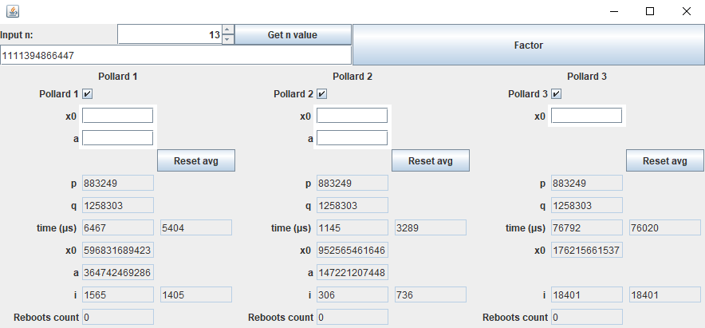

# **IUT-Pollard-RSA** :unlock::key:

Simple java interface showing Pollard's p-1 algorithms performance for up to 13 digits numbers.

**Maths background**: Pollard's p-1 algorithms are methods trying to solve the large integer factorization problem. This algorithm was developed by J. M. Pollard for purposes of decipher RSA encoded messages with reasonable time execution.

Pollard's algorithm time execution grows proportionally to the square root of the integer size.

:mortar_board: Made in the context of cryptography courses for a 2-year post A level degree (computer science). Of course, this project should not be taken as a top-notch implementation. As well, I do not guarantee a flawless maths reasoning as I'm not an expert.

## **Preview** :rocket::framed_picture:

## **Instructions** :wrench::gear:

- Run main class: `app.Application`
- **Note**: Tests written for JUnit 5